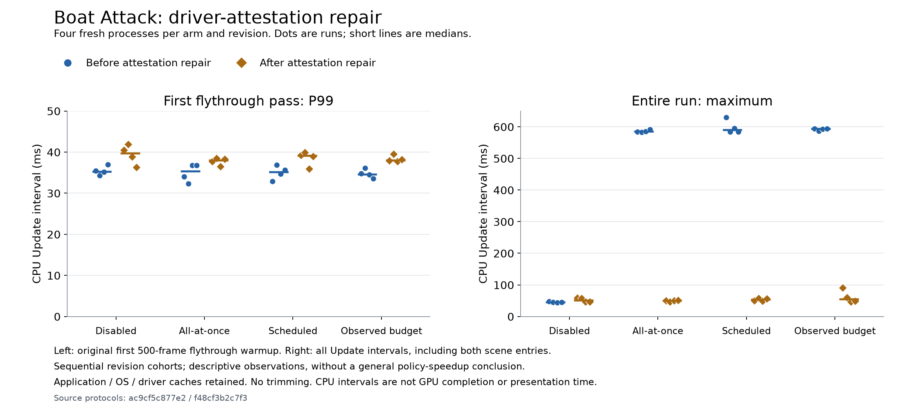

# Official Boat Attack: native evidence and repairs

Boat Attack completed native D3D12/IL2CPP training, plan installation, independent
content/policy checks, and two separately frozen 16-process comparisons. The
second comparison removed a verified **evidence-writing regression**. It does
**not** establish a scheduling speedup or improved useful first-draw coverage.
The default policy is unchanged; this Unity 6000.1 cell uses **native-async-bulk**,
not fixed-progressive.

## Workload and identities

The [official application](https://github.com/Unity-Technologies/BoatAttack/tree/6d51b73619199c6dc8266045ea5c494355acf6b5)
is pinned to commit `6d51b73619199c6dc8266045ea5c494355acf6b5`, tree
`3dea6169e8c4799e781e64af9c91043670a5df52`. The pristine checkout verification
covered 1,366 files / 983,323,082 bytes, including 183 LFS payloads /
946,564,614 bytes. The working host is explicitly adapted, not a pristine checkout.
The Unity Companion License and original source/asset identities are retained.

Both comparisons use Unity **6000.1.0f1 (9ea152932a88)**, Windows x64 Development
IL2CPP Player, D3D12, 1920×1080 windowed, original High quality, AMD Radeon AI PRO
R9700, driver **32.0.31041.1004**. Editor SHA-256 is
`d2336629da111800a35b592b8c8f595dda02c658a8e3e88c0e7d002e1a0a7f8b`.
The actual runtime reports **AMD Ryzen 9 9950X 16-Core Processor** and
`SystemInfo.processorCount=8` in both cohorts. A separate read-only Windows CIM
observation also reports eight cores, eight enabled cores and eight logical
processors. The formal commands set no worker or affinity override. The reason
Windows exposes that topology was not established; these results must not be
described as a full 32-logical-processor measurement.

The entry is the original benchmark loader, followed by Island Flythrough
**warmup + 3×500 frames**, Island Static **warmup + 5×25 frames**, and original
Exit. The original Cinemachine route, scenery, water, vegetation and materials
remain. The adapter observes native counters, actual camera transforms and render
callbacks. Code-captured correctness screenshots establish rendered scenery;
they are disabled in formal timing. The overlapping original HUD remains a
display limitation; its text is not used as measurement data.

| Evidence | Before receipt repair | After receipt repair |
|---|---|---|
| Attempt subdirectory | `boat-formal-01` | `boat-formal-02` |
| Final Player | `boat-final-05` | `boat-final-07` |
| Build GUID | `d03a7a0d35224c32be7aa887a3dc1cc6` | `253edbfc746f44d0b455794639595cfe` |
| Player files / bytes | 672 / 1,586,187,303 | 672 / 1,586,781,503 |
| Matching runtime/adapter source checkpoint | `073f4d4be51c5714fa1b64389ac2eee70428a424` | `fbe2d4813f7c980c0d9629606b7867001a5113b8` |

The builds retained the actual base commit plus dirty source snapshots; the
matching checkpoints were committed afterwards. These are file-identity mappings,
not claims that an earlier binary was rebuilt from a later documentation commit.
The full package/adapter snapshot indexes and Player indexes are retained.

## Declared repairs

* Correct stale lowercase serialized scene strings to the actual `Testing` paths;
  enable the original native result writer (`stats: 0 → 1`). Keep runs and warmup.
* Prevent the original DisplayOnly HUD from advancing the benchmark's frame
  counter a second time. The failed control rendered only 250 distinct flythrough
  frames; corrected runs render all 500 once per pass.
* Bind the static BenchmarkCamera to its existing original Cinemachine camera;
  add the uGUI-required `_MainTex` property without changing the shader fragment.
* Pin the official Splines **2.8.1** patch for SPLB-345 instead of the original
  2.8.0 finalizer failure. No Editor upgrade.
* Backport the narrow [official RenderGraph cleanup fix](https://github.com/Unity-Technologies/Graphics/commit/5b9c68a3755eefa71ee7af08b3fc5aac473c2985)
  into a new host-local Core RP 17.1.0 package. Keep cache/rendering features and
  pool capacity. Original registry cache bytes remain untouched. Repeated
  216-Persistent-allocation warnings, also reproduced with tracing disabled,
  disappeared in subsequent native runs. Earlier warnings and symbolized stacks remain.
* Keep generated test/Addressables metadata from destabilizing build identity,
  while attesting the effective PerformanceTest `MeasurementCount` and the actual
  Addressables `link.xml` bytes. Invalid plan/load cardinalities fail; genuine
  under-resolution has a typed, bounded retry contract.
* Admit native bulk work during the original noninteractive warmup traversals,
  with a declared **1000 ms per-admission estimate cap**. This adds no route wait
  and promises no hard latency bound. A prior scheduled pilot which submitted
  no flythrough/static work is retained as policy-incomplete.
* Replace fuzzy result-file timestamps with startup/exit file metadata snapshots,
  preventing an immediately preceding process's result from being attributed to
  the current run. The detected duplicate-result pilot is retained as failed.

## Verified completion-hitch repair

In the first formal sequence every warmup arm had roughly **583–629 ms** maximum
Update intervals, including two large intervals immediately after phase completion.
Disabled maxima were roughly 44–47 ms. P99 alone concealed this regression.

Direct native diagnosis measured repeated driver-byte attestation at **562–563 ms**
per call. `WriteReceipt → PsoUnityEnvironment.Capture` synchronously rehashed four
loaded DriverStore DLLs totaling **127,287,696 bytes**. Native batch durations did
not include that work.

The repair preserves byte hashes in a process-local snapshot. Every environment
capture checks device/registry/module-address/file metadata; changed or failed
probes invalidate the snapshot, and a full hash is checked again for concurrent
identity changes. Each receipt gets its own module objects. Explicit invalidation
is available for an application-known device reset. Byte-attested UTC, latest
metadata-checked UTC and reuse status are distinct. Reuse is not a fresh byte hash
or a continuous file-integrity guarantee; callers still refresh scheduling
compatibility on relevant environment changes.

Same-route native diagnosis retained the initial approximately **574 ms** byte
attestation. Repeated driver checks measured **0.27–0.42 ms** after the repair,
down from approximately **563 ms**. The
[published diagnostic timings](Evidence/boat-attack-20260914/attestation-diagnostic-timings.json)
preserve all recorded operations from the three diagnostic processes; their
SHA-256 is `4e637e5fda316a752432b7933720d3c869f3f55d1c98a2b1234faef5da320f12`,
matching `diagnosticTimingsSha256` in the
[verification receipt](Verification/boatattack-native-20260914.json).
These diagnostic operations are separate from the formal comparison cohorts.
The same-route training diagnostic measured subsequent complete environment captures at about
**0.76–0.84 ms**. A final-Player diagnostic measured receipt writes around
**16–25 ms**; these costs remain visible in the full capture. This fixes our
instrumentation overhead, not Unity/driver shader compilation.

## Independent post-repair comparison

Four new processes per arm, balanced Williams order:
`A B D C / B C A D / C D B A / D A C B`, where A=disabled, B=all-at-once,
C=scheduled, D=observed-budget. Each sequence freezes one common Player, plan,
source/content/settings/driver identity, full original routes and stop conditions.
All arms retain the same encountered shaders and seeded baseline observation;
disabled must submit zero warmup. Warmup arms must submit/complete all three
planned collections (6/83/66 states) and release native owners.

Cache condition is **new process with existing application/OS/driver caches after
training and pilots retained**. There is no global purge or driver-cold claim.
The two sequences use different identified Players/plans and are not pooled as
one unchanged experimental cell. All pre-repair and failed results remain.

| Arm | Median whole-observer time (s) | Median first flythrough warmup P95 / P99 (ms) | Maximum Update (ms) | >50 ms intervals, all 4 processes |
|---|---:|---:|---:|---:|
| disabled | 32.970 | 29.637 / 39.693 | 58.353 | 4 |
| all-at-once | 33.390 | 30.013 / 37.988 | 51.737 | 2 |
| scheduled | 33.487 | 29.930 / 39.127 | 57.728 | 3 |
| observed-budget | 33.458 | 29.762 / 38.034 | 90.256 | 2 |

All 16 completed the native gates, with **zero >200 ms or >500 ms intervals**,
no allocation-leak warning and an unchanged final Player index. Other hitch
thresholds, every process sample, memory observations, native warmed results and
raw timings remain recorded. The approximately 0.6-second regression did not recur;
the 90.256 ms observed-budget maximum and negative whole-time differences remain.
Four processes per arm do not establish population significance or a scheduling gain.

The [reviewed figure and public points](Evidence/boat-attack-20260914/README.md)
retain all 32 samples and both sequential cohorts. Its generator reproduces the
figure from the published points; it does not substitute for raw-capture audits.

Intervals are measured between CPU Updates; a render submission in frame N is
associated with the following Update interval when available. They are **not GPU
completion or presentation times**. Initial observer/startup gaps, load/warmup
transitions, all intervals and normal process exit are retained; no outlier is trimmed.

## Coverage and remaining limits

The seeded native baseline grew from 111 to 205 entries in the earlier final
pilots. The legacy field `cacheMissGraphicsStates=94` is **unverified native entry
growth**, not 94 demonstrated compilation misses, hitches, or a useful-coverage
percentage. Public payload inspection initially distinguished 18 differences;
opaque native equality remained unresolved.

A bounded uninterrupted full-process diagnostic captured 94 states, including
terrain-generation/Blit groups. Actual Load/GetVariants/GetGraphicsStates
inspection found zero public-field differences after offline round-trip, but
23 continuous-only and 42 segmented-only public payloads against the segmented
union. That does not establish native identity equality or an augmented plan's
independent useful coverage. The diagnostic was neither installed into these
formal plans nor counted as a favorable formal run. Baseline arming and any
earlier observation blind interval remain explicit.

This is official external application evidence, not a standardized cross-engine
PSO score. Megacity Menu-only evidence and historical controlled-reveal results
do not establish native Main acceptance. Historical 127→12.9, 643.5→774.6,
178.9 ms and 4.169/4.210 results retain their original cells and are not attributed
to these repairs.

See the [adapter and reproduction commands](../Integrations/BoatAttack/README.md).
Raw immutable evidence is under `work/actual-20260914-external-01/`; it is intentionally
excluded from Git together with third-party assets, caches and Players.
