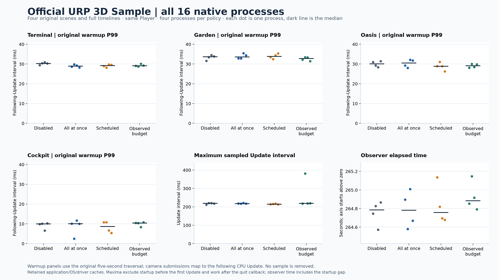

# Official URP 3D Sample: all 16 native processes



The four scene panels show each process's P99 following-Update interval during the original five-second warmup traversal. They share the same zero-based scale. The other panels show the maximum sampled CPU Update interval and observer elapsed time. The elapsed-time axis intentionally starts above zero; its scale is labelled. Every dot is one actual process, four per policy; dark segments are medians. Points in different panels belong to the same 16 processes and are not additional independent repetitions.

The complete official Terminal, Garden, Oasis and Cockpit timelines run in one common Windows D3D12/IL2CPP Player under a frozen 16-process Williams order. Application, OS and driver caches were retained after training and pilots. These results are descriptive repetitions, not a driver-cold test, general PSO score, or demonstrated overall scheduling gain. Maxima include all sampled Update intervals, without trimming the 381.3446 ms observed-budget sample. Work before the first Update and after the quit callback is outside that maximum; startup and final observer gaps are retained separately in the public points/audit. These are CPU observation intervals, not GPU completion or presentation times.

`source-points.json` retains every plotted value, per-run validation/capture/native-CSV/log SHA-256 values and the frozen source/Player/protocol identities. `independent-audit.json` records independent raw recomputation of all 16 process streams, original native CSVs, route intervals, elapsed/memory values, actual strategies and completed native phase counts. Its phase-event diagnostic context uses actual frame IDs and preserves Unity realtime separately from the observer Stopwatch. A bootstrap offset is not treated as an exact cross-clock conversion or causal profiler sample.

From this directory, with the pinned dependencies installed in an isolated Python environment, reproduce the figure into a fresh directory:

```powershell
python plot_urp_comparison_20260914.py --points source-points.json --output NEW_DIRECTORY
```

The public-points mode redraws the published data; it does not replace checking raw captures against their hashes. With the original completed local attempt available, `--folder ATTEMPT/urp-formal-01` instead runs the bundled independent audit before exporting the plot. Neither command launches Unity. No third-party scene assets, Player binaries or raw machine logs are distributed in this bundle.

The PNG/SVG were rendered with Matplotlib 3.11.2. All six panels were visually checked for unclipped labels, visible process points, explicit units and honest scales. A second rendering using only the public points reproduced identical PNG and SVG bytes; publication-qa.json retains the verified hashes. The PNG SHA-256 is `e18ff533a12739077faf1eb48744f32e80a366410fcf99821f55b8ee968dc5dc`.
