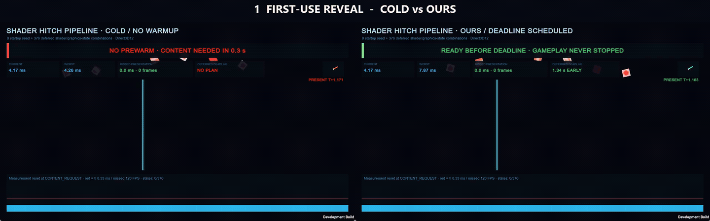

# Shader Hitch Pipeline

An independent Unity 6 UPM package for eliminating first-use shader and graphics-pipeline hitches on modern graphics APIs. It records the **actual shader variant + render-state combinations** seen by a player, produces a reproducible warmup profile, schedules GPU-representation creation by deadline, measured cost, and hot-set value, and proves the result with a controlled A/B/C run.

This is a performance pipeline, not a crash detector, culling system, asset simplifier, or streaming layer.



This is a synchronized capture of three **actual Unity Players**, not a chart animation or reconstructed replay. The panels are cold first use, Unity's all-at-once collection warmup, and this package's deadline-scheduled progressive warmup. The workload and first visible tile are synchronized from video pixels after each Player's `WORKLOAD_START` marker. The moving scanline and clock are rendered by the Player; a hitch freezes or jumps them without any injected delay. Red columns are real presented frames that exceeded 8.33 ms. The higher-quality [MP4](Docs/Media/actual-comparison.mp4), [warmup-pressure MP4](Docs/Media/actual-warmup-comparison.mp4), [poster](Docs/Media/actual-comparison.png), and secondary [raw-sample chart](Docs/Media/comparison.gif) are retained with the repository.

## Measured result

The included showcase was measured on Unity 6000.5.2f1, D3D12, and an AMD Radeon AI PRO R9700. Each run contains 240 raw frame samples and the same 384-object reveal workload.

| Metric | Cold first use | Unity all-at-once | Deadline scheduled | Scheduled vs cold |
|---|---:|---:|---:|---:|
| Mean | 8.861 ms | 4.169 ms | 4.201 ms | 52.6% lower |
| P95 | 35.706 ms | 4.169 ms | 4.210 ms | 88.2% lower |
| P99 | 40.674 ms | 4.203 ms | 4.279 ms | 89.5% lower |
| Maximum | 46.387 ms | 4.436 ms | 9.799 ms | 78.9% lower |
| Frames ≥ 8.33 ms | 48 | 0 | 1 | 47 eliminated |
| Severe stalls ≥ 16.67 ms | 48 | 0 | 0 | 48 eliminated |

The generated plan covered 388 shader variants and 389 graphics states. A two-repeat 24-candidate worker/batch search selected two async workers and an initial batch of 64 on this machine (577.8 ms median warmup, 30.6 ms median worst warmup frame). In the externally recorded acceptance run, all-at-once completed in 643.5 ms as one batch; scheduled completed in 774.6 ms across 20 batches. Scheduled reduced sustained warmup pressure—P95 fell from 127.0 ms to 12.9 ms—but retained one 178.9 ms capture-window outlier, so the full distribution is reported rather than reduced to a favorable maximum. The measured workload had one isolated 9.80 ms scheduled frame, but zero ≥16.67 ms severe stalls, zero `Shader.CreateGPUProgram` time, and a plan-scoped feedback trace of 389 expected / 389 observed states (zero misses). Results are hardware, driver, project, and cache-state dependent; use the included search and runner for each target profile.

## What it adds beyond Unity

Unity and the graphics driver remain responsible for shader compilation and PSO creation. This package deliberately does not recreate either. It adds the missing production workflow around Unity's `GraphicsStateCollection`:

- player-side, phase-aware trace sessions with environment manifests;
- strict platform/API/quality isolation;
- SHA-256 verification for every input collection and generated plan;
- deterministic deduplication and merge receipts;
- deadline-, observed-cost-, probability-, and hot-set-aware phase selection;
- batch-boundary reprioritization with adaptive progressive warmup;
- hardware-local async-worker/batch Pareto search with an applied recommendation;
- plan-scoped, pre-seeded feedback tracing that reports true post-plan misses without misclassifying progressive warmup batches;
- build-time target/API validation and build receipts;
- identical-workload cold/all-at-once/scheduled benchmarks with raw samples;
- synchronized three-Player MP4/GIF capture with marker-bounded pixel alignment;
- JSON, Markdown, PNG, and raw-sample animated GIF evidence.

The Unity API is experimental, so all direct API usage is isolated behind a small runtime/editor boundary. If Unity changes it, the application-facing trace, plan, benchmark, and receipt contracts remain stable.

## Repository layout

```text
Packages/com.yanagisawa.shader-hitch-pipeline/  Reusable UPM package
  Runtime/                                      Trace, plan validation, warmup, benchmark
  Editor/                                       Merge, install, build gate, control center
  Samples~/PSO Hitch Showcase/                  Measurable 384-state demo
  Tests/Editor/                                 Deterministic unit tests
UnityProject/                                   Minimal development and acceptance project
Tools/                                          One-command showcase and evidence generator
Docs/                                           Architecture, CLI, methodology, media
```

Generated player traces, plans, reports, and builds stay outside package source and are ignored by Git. This keeps project data and the reusable tool legally and technically separate.

## Quick start

Install the tagged package directly from GitHub with Unity Package Manager's
**Add package from git URL** action:

```text
https://github.com/Yanagisawa2002/unity-shader-hitch-pipeline.git?path=/Packages/com.yanagisawa.shader-hitch-pipeline#v0.2.0
```

Then:

1. Import the package's **PSO Hitch Showcase** sample, or add the runtime package to your own player.
2. Build a development player for D3D12, Metal, or Vulkan.
3. Run a representative trace:

```powershell
YourGame.exe `
  -pso-disable-warmup `
  -pso-trace `
  -pso-trace-phase startup `
  -pso-session qa-2026-09-01 `
  -pso-output C:\PsoArtifacts
```

4. Copy or point the Editor at `C:\PsoArtifacts\Inbox`, then use **Tools > Shader Hitch Pipeline > Control Center** to process and install the plan.
5. Rebuild. The build gate rejects a plan for the wrong runtime platform or graphics API.
6. The final player automatically loads `StreamingAssets/ShaderHitchPipeline/plan.json` and prewarms phases marked for startup.

For an end-to-end portfolio run from this repository:

```powershell
python -m pip install -r Tools/requirements.txt
ffmpeg -version
pwsh Tools/Invoke-PsoShowcase.ps1
```

The Windows showcase runner builds a cache-isolated training Player, records the cold trace and visible client area, installs the resulting plan, builds the matching final Player, searches worker/batch candidates, records the all-at-once and scheduled Players, and emits both visual and numerical evidence. Pixel synchronization cannot search before each Player's workload marker, and every capture is checked for blank/obscured output. The GPU Player is intentionally visible during capture; a hidden or obscured Windows swapchain may stop presenting or produce invalid video.

## Runtime phases

Startup phases are automatic. Later phases can be activated shortly before the content is needed:

```csharp
PsoWarmupOrchestrator.Instance.ActivatePhase("combat");
```

Representative traces can be split the same way:

```csharp
PsoTraceController trace = PsoTraceController.EnsureInstance();
trace.Configure("nightly-win-d3d12", @"C:\PsoArtifacts", false);
trace.BeginPhase("combat", "city", "rain");
// Exercise the representative workload.
trace.EndPhase();
```

Each trace phase becomes a schedulable unit. Tier 0 is the critical hot set; higher tiers are progressively colder. A finite deadline is measured from phase activation. The scheduler first protects work whose estimated remaining cost threatens its deadline, then considers hot-set tier, expected-use probability per remaining millisecond, stable priority, and phase name. Batch costs are updated from completed jobs during the run.

## Support and constraints

- Unity 6.0 or newer.
- `GraphicsStateCollection` targets modern APIs: D3D12, Metal, and Vulkan. D3D11 requires a different shader warmup strategy and is intentionally not mislabeled as PSO coverage.
- Capture once per runtime platform, graphics API, quality level, and materially different shader build.
- A plan must ship with the build whose shader set it was generated for.
- Profiler marker availability varies by Unity build/platform; frame-time samples and warmup completion receipts are always retained.

See [Architecture](Docs/ARCHITECTURE.md), [CLI reference](Docs/CLI.md), [integration guide](Docs/INTEGRATION.md), and [benchmark methodology](Docs/BENCHMARK_METHODOLOGY.md).

## Ownership

Copyright © 2026 Edwin Liu. All rights reserved. See [LICENSE.md](LICENSE.md) and [PROVENANCE.md](PROVENANCE.md). This repository is an independent clean-room implementation and contains no employer-project source or assets.
