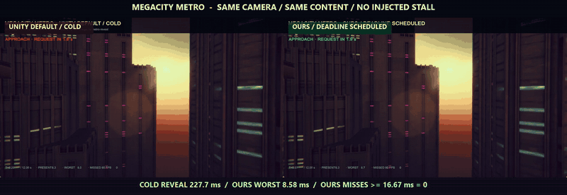

# Shader Hitch Pipeline

An independent Unity 6 UPM package for eliminating first-use shader and graphics-pipeline hitches on modern graphics APIs. It records the **actual shader variant + render-state combinations** seen by a player, gates the required startup hot set before the first presented frame, schedules deferred work by hard admission budget, deadline, measured cost, and hot-set value, and proves the result with a controlled A/B/C run.

This is a performance pipeline. An opt-in [Addressables integration](Integrations/Addressables/README.md)
adds loaded-content PSO registration, incremental deduplication and fenced resource retention;
the base package remains usable without Addressables.

## Deadline Run hero benchmark (accepted)

`Deadline Run` is a separate 12-second cinematic acceptance scene. A fixed
high-speed camera crosses an industrial tunnel and reveals a preallocated,
rain-soaked combat airspace containing 320 upcoming shader/render-state
combinations. World-space turbines, rain, hostile drones, a tracked vehicle,
its real trail, and a continuously advancing 12-second flight clock expose a
presentation freeze without relying on the original scanline. No sleep, busy
loop, streaming, or deadline-frame object creation is used.

Its portfolio gate requires a naturally measured cold frame of at least 80 ms
and zero scheduled frames at or above 16.67 ms, plus a completed hard-budget
phase that meets the same 2.5-second content deadline. Accepted D3D12 run
`20260903-031014` measured a 1,039.290 ms cold reveal and a 5.093 ms scheduled
maximum with zero scheduled misses. The scheduled phase completed 351 traced
graphics states in 19 admitted batches, reported zero budget violations and
zero cache misses, and met the deadline without an injected stall.

Only a passed receipt can enter the compositor. Its measured cold reveal,
scheduled worst frame, and scheduled miss count are burned into the bottom of
the real two-up/three-way footage so the visual claim remains auditable.

```powershell
Tools/Invoke-PsoDeadlineRun.ps1
```

## Megacity Metro actual-picture validation



The pinned external adapter under `Integrations/MegacityMetro` passed its full
three-arm D3D12 workflow in run `20260903-054644`. This is Unity's public
Megacity Metro scene with the same camera, city, 48-state reveal, and no injected
stall in each arm. The cold Player visibly freezes at reveal; the scheduled
Player preserves the continuously moving city view.

| Metric | Cold | Unity all-at-once | Deadline scheduled |
|---|---:|---:|---:|
| Maximum retained frame | 227.658 ms | 8.569 ms | 8.581 ms |
| Frames ≥ 16.67 ms | 1 | 0 | 0 |
| Managed collections in 12 s | 0 | 0 | 0 |

The scheduled scenario-wide maximum was 8.738 ms, a 96.23% reduction from the
cold retained maximum. Hardware-local search selected one worker; all 48 traced
states completed in 16.793 ms, 2.48 seconds before their deadline, with strict
admission, zero budget violations, and zero plan-feedback cache misses. The
all-at-once control also happened to remain below 16.67 ms on this machine; its
receipt therefore demonstrates parity, not a fabricated loss, while only the
scheduled arm carries the hard-budget admission contract. See the higher-quality
[MP4](Docs/Media/megacity-metro-actual-comparison.mp4) and
[poster](Docs/Media/megacity-metro-actual-comparison.png), plus the portable
[machine-readable comparison](Docs/Media/megacity-metro-comparison.json) and
[Markdown summary](Docs/Media/megacity-metro-comparison.md). The
[publication manifest](Docs/Media/megacity-metro-publication.json) preserves the
source acceptance/media hashes and the unchanged H.264 stream hash.

The formal cell uses Unity 6000.1.0f1, AMD Radeon AI PRO R9700, Medium quality,
D3D12, 1280x720 native output/render scale 1.0, a 150 m street-canyon view, and
a 120 Hz producer. It inventories the pinned 6,947-renderer corridor, executes
two full real-city camera circuits before freezing Initialization/Simulation,
keeps Entities Presentation active, and requires a new three-second sub-14 ms
window with capture active before T+0. This is a PSO-isolation validation cell,
not a claim about unrestricted whole-city throughput. No Megacity source asset
is redistributed in this repository; the published media is rendered evidence.

The deterministic tile showcase remains the CI/microbenchmark.

## Current deterministic microbenchmark evidence


This is a synchronized capture of **actual Unity Players**, not a chart animation or reconstructed replay. Chapter 1 compares cold first use with the scheduled path at `CONTENT_REVEAL`. Chapter 2 compares Unity all-at-once with the scheduler when a real deferred `combat` phase is activated mid-game at `CONTENT_REQUEST`; both receive the same 1.50 s deadline and the content appears regardless of readiness. Eight startup seed states keep the scene moving while 376 deferred tiles remain unavailable. The scanline, clock, frame history, red border, and hitch banner are rendered by the Player, so a hitch visibly freezes or jumps the scene without an injected delay.

Each raw video is validated through `CONTENT_COMPLETE`. The first visible tile is detected in pixels, and the other event times are recovered from the Player's monotonic marker intervals. Red columns are real presented frames above 8.33 ms. The repository retains the higher-quality [two-chapter MP4](Docs/Media/actual-comparison.mp4), [first-use MP4](Docs/Media/actual-first-use-comparison.mp4), [deferred-request MP4](Docs/Media/actual-warmup-comparison.mp4), [scorecard](Docs/Media/actual-scorecard.png), [poster](Docs/Media/actual-comparison.png), and secondary [raw-sample chart](Docs/Media/comparison.gif).

## Measured result

The accepted `20260902-064931` showcase was measured on Unity 6000.5.2f1, D3D12, and an AMD Radeon AI PRO R9700. Each full Player window contains 1080 raw frame samples and the same 384-object workload. All three Players ran at Windows `High` priority while the identical external recorder ran at `BelowNormal`; those controls are written into `visual-alignment.json`.

| Metric | Cold first use | Unity all-at-once | Deadline scheduled | Scheduled vs cold |
|---|---:|---:|---:|---:|
| Mean | 4.743 ms | 4.220 ms | 4.173 ms | 12.0% lower |
| P95 | 8.372 ms | 4.169 ms | 4.169 ms | 50.2% lower |
| P99 | 10.030 ms | 4.268 ms | 4.363 ms | 56.5% lower |
| Maximum | 32.519 ms | 23.552 ms | 7.867 ms | 75.8% lower |
| Frames ≥ 8.33 ms | 57 | 5 | 0 | 57 eliminated |
| Severe stalls ≥ 16.67 ms | 1 | 2 | 0 | 1 eliminated |

The deferred phase is the direct scheduler comparison; it excludes unrelated recorder/OS frames elsewhere in the 1080-frame window:

| Deferred `combat` evidence | Unity all-at-once | Deadline scheduled |
|---|---:|---:|
| Graphics states | 388 | 388 |
| Admitted batches | 1 | 34 |
| Phase elapsed | 40.175 ms | 152.346 ms |
| Maximum presented frame | 15.902 ms | 7.867 ms |
| Frames ≥ 8.33 ms | 1 | 0 |
| Budget violations | not guaranteed | 0 |
| 1.50 s deadline | met | met |

All-at-once finishes sooner but spends the presentation budget in one opaque call. The scheduler intentionally uses more of the available slack, re-estimates cost after every admitted batch, and finishes with zero misses and zero admission violations. The phase-local plan contains 400 variants / 401 graphics-state entries; cross-phase overlap reduces that to 389 unique observed states, and feedback reported 389 expected / 389 observed with zero misses.

The earlier `178.9 ms` tail was traced to a 64-state first batch (`165.36 ms`). An irreducible one-state cold probe still produced a `119.05 ms` backend call and a `131.59 ms` frame, proving that admission control cannot preempt a driver call after entry. The v0.3 startup path therefore keeps the required hot set behind a first-present latency boundary, while this new showcase demonstrates the complementary hard-budget path for genuinely deferred content. The five-run AMD **OS-level matrix** remains provisional until PresentMon CSV and WPR GPU ETL can be captured with the required Windows trace-session privilege; NVIDIA and Intel hardware rows remain pending. The accepted Megacity visual/engine receipt above does not silently promote that separate five-run ETW matrix cell.

## What it adds beyond Unity

Unity and the graphics driver remain responsible for shader compilation and PSO creation. This package deliberately does not recreate either. It adds the missing production workflow around Unity's `GraphicsStateCollection`:

- player-side, phase-aware trace sessions with environment manifests;
- strict platform/API/quality isolation;
- SHA-256 verification for every input collection and generated plan;
- deterministic deduplication and merge receipts;
- deadline-, observed-cost-, probability-, and hot-set-aware phase selection;
- a required-hot-set first-present gate plus strict admission for deferred batches;
- cold/steady probes, fixed+slope online cost fitting, safety margin, cooldown, and circuit breaker;
- hardware-local async-worker/dynamic-ceiling Pareto search that never forces a large cold batch;
- plan-scoped, pre-seeded feedback tracing that reports true post-plan misses without misclassifying progressive warmup batches;
- build-time target/API validation and build receipts;
- identical-workload cold/all-at-once/scheduled benchmarks with raw samples;
- synchronized three-Player MP4/GIF capture with marker-bounded pixel alignment;
- JSON, Markdown, PNG, and raw-sample animated GIF evidence;
- an engine-neutral `netstandard2.0` core, versioned JSON schemas, and trace/warmup adapter interfaces;
- PresentMon v2 CSV analysis, optional WPR GPU ETL capture, SHA-256 manifests, and a non-fabricated NVIDIA/AMD/Intel × controlled/large-scene matrix.

The Unity API is experimental, so all direct API usage is isolated behind a small runtime/editor boundary. If Unity changes it, the application-facing trace, plan, benchmark, and receipt contracts remain stable.

## Repository layout

```text
Packages/com.yanagisawa.shader-hitch-pipeline/  Reusable UPM package
  Core/                                         No-engine contracts, plan rules, scheduler
  Runtime/                                      Unity adapters, orchestration, benchmark
  Editor/                                       Merge, install, build gate, control center
  Samples~/PSO Hitch Showcase/                  Measurable 384-state demo
  Samples~/Deadline Run/                         12-second cinematic visual gate
  Tests/Editor/                                 Deterministic unit tests
UnityProject/                                   Minimal development and acceptance project
Tools/                                          One-command showcase and evidence generator
Integrations/MegacityMetro/                      Pinned external large-scene adapter
Docs/                                           Architecture, CLI, methodology, media
DotNet/                                         netstandard core + portability smoke test
Schemas/                                        Versioned trace/plan/receipt interchange
Matrix/                                         Public vendor × scene evidence status
```

Generated player traces, plans, reports, and builds stay outside package source and are ignored by Git. This keeps project data and the reusable tool legally and technically separate.

## Quick start

The latest stable tag is `v0.2.0`; v0.3 is currently the development line in
this branch. Install the tagged package with Unity Package Manager's **Add
package from git URL** action:

```text
https://github.com/Yanagisawa2002/unity-shader-hitch-pipeline.git?path=/Packages/com.yanagisawa.shader-hitch-pipeline#v0.2.0
```

Then:

1. Import the package's **PSO Hitch Showcase** sample, or add the runtime package to your own player.
2. Build a development player for D3D12, Metal, or Vulkan.
3. Run a representative trace:

```powershell
YourGame.exe `
  -pso-disable-warmup `
  -pso-trace `
  -pso-trace-phase startup `
  -pso-session qa-2026-09-01 `
  -pso-output C:\PsoArtifacts
```

4. Copy or point the Editor at `C:\PsoArtifacts\Inbox`, then use **Tools > Shader Hitch Pipeline > Control Center** to process and install the plan.
5. Rebuild. The build gate rejects a plan for the wrong runtime platform or graphics API.
6. The final player automatically loads `StreamingAssets/ShaderHitchPipeline/plan.json` and prewarms phases marked for startup.

For an end-to-end portfolio run from this repository:

```powershell
python -m pip install -r Tools/requirements.txt
ffmpeg -version
pwsh Tools/Invoke-PsoShowcase.ps1
```

The Windows showcase runner builds a cache-isolated training Player, records separate `startup` and deferred `combat` trace phases, installs the resulting plan, builds the matching final Player, optionally searches worker/dynamic-ceiling candidates, and records cold, all-at-once, and deadline-scheduled controls. It retains 1080 frame samples, waits for `CONTENT_REQUEST`, `CONTENT_REVEAL`, and `CONTENT_COMPLETE`, validates the visible client pixels, and produces the two-chapter visual plus numerical receipts. The Players and recorder use explicit, identical priority controls; high-quality composition runs only after every measured Player exits.

## Runtime phases

Required startup phases are completed before the first scene frame by default. Later phases can be activated shortly before the content is needed and are governed by strict admission plus deadline/cost/hot-set scheduling:

```csharp
PsoWarmupOrchestrator.Instance.ActivatePhase("combat");
```

Representative traces can be split the same way:

```csharp
PsoTraceController trace = PsoTraceController.EnsureInstance();
trace.Configure("nightly-win-d3d12", @"C:\PsoArtifacts", false);
trace.BeginPhase("combat", "city", "rain");
// Exercise the representative workload.
trace.EndPhase();
```

Each trace phase becomes a schedulable unit. Tier 0 is the critical hot set; higher tiers are progressively colder. A finite deadline is measured from phase activation. The scheduler first protects work whose estimated remaining cost threatens its deadline, then considers hot-set tier, expected-use probability per remaining millisecond, stable priority, and phase name. Batch costs are updated from completed jobs during the run.

## Support and constraints

- Unity 6.0 or newer.
- `GraphicsStateCollection` targets modern APIs: D3D12, Metal, and Vulkan. D3D11 requires a different shader warmup strategy and is intentionally not mislabeled as PSO coverage.
- Capture once per runtime platform, graphics API, quality level, and materially different shader build.
- A plan must ship with the build whose shader set it was generated for.
- Profiler marker availability varies by Unity build/platform; frame-time samples and warmup completion receipts are always retained.

See [Architecture](Docs/ARCHITECTURE.md), [CLI reference](Docs/CLI.md), [integration guide](Docs/INTEGRATION.md), [benchmark methodology](Docs/BENCHMARK_METHODOLOGY.md), and [Windows PresentMon/ETW evidence](Docs/WINDOWS_EVIDENCE.md).

## Ownership

Copyright © 2026 Edwin Liu. All rights reserved. See [LICENSE.md](LICENSE.md) and [PROVENANCE.md](PROVENANCE.md). This repository is an independent clean-room implementation and contains no employer-project source or assets.
