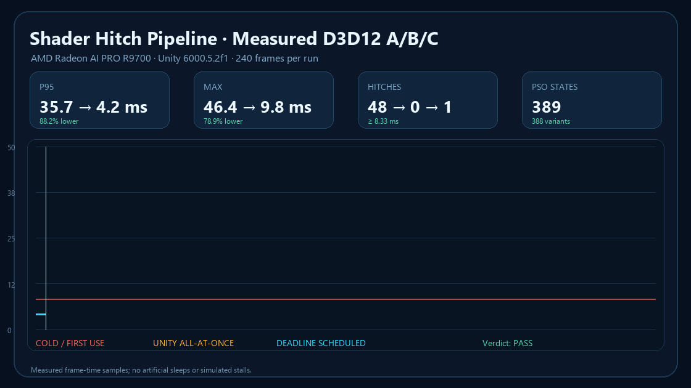

# Shader Hitch Pipeline

An independent Unity 6 UPM package for eliminating first-use shader and graphics-pipeline hitches on modern graphics APIs. It records the **actual shader variant + render-state combinations** seen by a player, produces a reproducible warmup profile, progressively creates the corresponding GPU representations, and proves the result with a controlled A/B run.

This is a performance pipeline, not a crash detector, culling system, asset simplifier, or streaming layer.



## Measured result

The included showcase was measured on Unity 6000.5.2f1, D3D12, and an AMD Radeon AI PRO R9700. Both runs contain 240 raw frame samples and the same 384-object reveal workload.

| Metric | Cold first use | Prewarmed | Change |
|---|---:|---:|---:|
| Mean | 6.466 ms | 4.167 ms | 35.6% lower |
| P95 | 26.738 ms | 4.169 ms | 84.4% lower |
| P99 | 34.941 ms | 4.172 ms | 88.1% lower |
| Maximum | 39.643 ms | 4.271 ms | 89.2% lower |
| Frames ≥ 8.33 ms | 24 | 0 | 24 eliminated |

The generated plan covered 260 shader variants and 389 graphics states. The final warmup receipt confirmed 389/389 completion in 228.6 ms. Results are hardware, driver, project, and cache-state dependent; use the included runner to produce evidence for each target profile.

## What it adds beyond Unity

Unity and the graphics driver remain responsible for shader compilation and PSO creation. This package deliberately does not recreate either. It adds the missing production workflow around Unity's `GraphicsStateCollection`:

- player-side, phase-aware trace sessions with environment manifests;
- strict platform/API/quality isolation;
- SHA-256 verification for every input collection and generated plan;
- deterministic deduplication and merge receipts;
- frame-budgeted progressive warmup with an adaptive batch size;
- cache-miss feedback files for the next training cycle;
- build-time target/API validation and build receipts;
- identical-workload cold/prewarmed benchmarks with raw samples;
- JSON, Markdown, PNG, and animated GIF evidence.

The Unity API is experimental, so all direct API usage is isolated behind a small runtime/editor boundary. If Unity changes it, the application-facing trace, plan, benchmark, and receipt contracts remain stable.

## Repository layout

```text
Packages/com.yanagisawa.shader-hitch-pipeline/  Reusable UPM package
  Runtime/                                      Trace, plan validation, warmup, benchmark
  Editor/                                       Merge, install, build gate, control center
  Samples~/PSO Hitch Showcase/                  Measurable 384-state demo
  Tests/Editor/                                 Deterministic unit tests
UnityProject/                                   Minimal development and acceptance project
Tools/                                          One-command showcase and evidence generator
Docs/                                           Architecture, CLI, methodology, media
```

Generated player traces, plans, reports, and builds stay outside package source and are ignored by Git. This keeps project data and the reusable tool legally and technically separate.

## Quick start

1. Add `Packages/com.yanagisawa.shader-hitch-pipeline` as a local or Git UPM dependency.
2. Import the **PSO Hitch Showcase** sample, or add the runtime package to your own player.
3. Build a development player for D3D12, Metal, or Vulkan.
4. Run a representative trace:

```powershell
YourGame.exe `
  -pso-disable-warmup `
  -pso-trace `
  -pso-trace-phase startup `
  -pso-session qa-2026-09-01 `
  -pso-output C:\PsoArtifacts
```

5. Copy or point the Editor at `C:\PsoArtifacts\Inbox`, then use **Tools > Shader Hitch Pipeline > Control Center** to process and install the plan.
6. Rebuild. The build gate rejects a plan for the wrong runtime platform or graphics API.
7. The final player automatically loads `StreamingAssets/ShaderHitchPipeline/plan.json` and prewarms phases marked for startup.

For an end-to-end portfolio run from this repository:

```powershell
python -m pip install -r Tools/requirements.txt
pwsh Tools/Invoke-PsoShowcase.ps1
```

The GPU player is intentionally visible during capture; a hidden Windows swapchain may stop presenting and produce an empty trace.

## Runtime phases

Startup phases are automatic. Later phases can be activated shortly before the content is needed:

```csharp
PsoWarmupOrchestrator.Instance.ActivatePhase("combat");
```

Representative traces can be split the same way:

```csharp
PsoTraceController trace = PsoTraceController.EnsureInstance();
trace.Configure("nightly-win-d3d12", @"C:\PsoArtifacts", false);
trace.BeginPhase("combat", "city", "rain");
// Exercise the representative workload.
trace.EndPhase();
```

## Support and constraints

- Unity 6.0 or newer.
- `GraphicsStateCollection` targets modern APIs: D3D12, Metal, and Vulkan. D3D11 requires a different shader warmup strategy and is intentionally not mislabeled as PSO coverage.
- Capture once per runtime platform, graphics API, quality level, and materially different shader build.
- A plan must ship with the build whose shader set it was generated for.
- Profiler marker availability varies by Unity build/platform; frame-time samples and warmup completion receipts are always retained.

See [Architecture](Docs/ARCHITECTURE.md), [CLI reference](Docs/CLI.md), [integration guide](Docs/INTEGRATION.md), and [benchmark methodology](Docs/BENCHMARK_METHODOLOGY.md).

## Ownership

Copyright © 2026 Edwin Liu. All rights reserved. See [LICENSE.md](LICENSE.md) and [PROVENANCE.md](PROVENANCE.md). This repository is an independent clean-room implementation and contains no employer-project source or assets.
